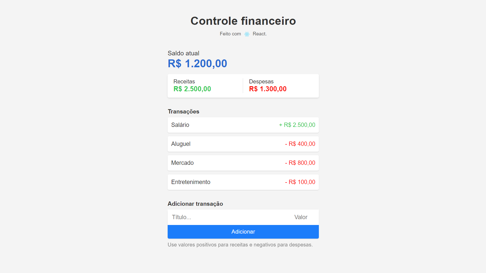

# 10-javascript-frameworks

O mesmo aplicativo desenvolvido em 10 frameworks diferentes.

1.  Vanila JS
2.  React
3.  Vue
4.  Angular
5.  Svelte
6.  Solid
7.  AlpineJS
8.  Stencil
9.  Lit
10. Glimmer.js

